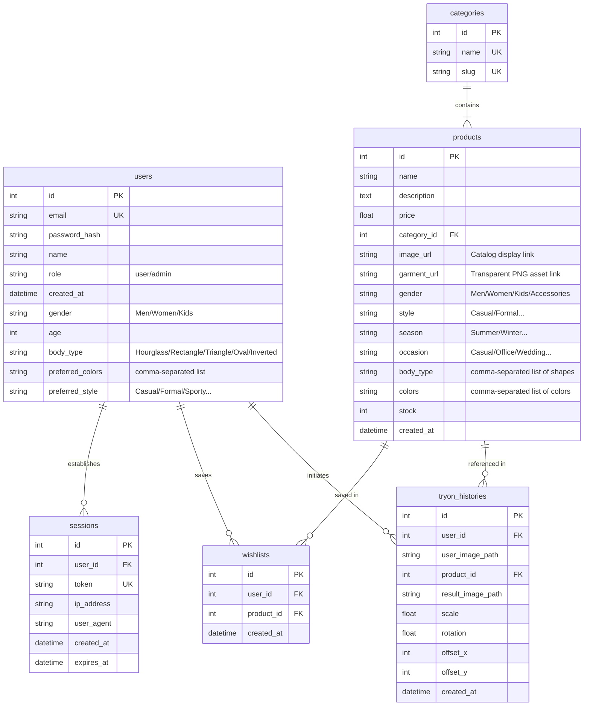

# Database Schema

We use **SQLAlchemy** to interface with a local **SQLite** database. SQLite is secure, zero-config, and highly robust for small-to-medium systems. All fields are sanitized to prevent SQL injection.

---

---

## Model Descriptions

1. **User Table (`users`)**: Stores credentials and active styling/body preferences. Demarcates administrators using the `role` field.
2. **Category Table (`categories`)**: Hierarchical catalog categories mapping products to segments (e.g. `men`, `women`, `kids`, `accessories`).
3. **Product Table (`products`)**: Catalog specifications containing matching metadata tags for color, style, body structure, occasion, and climate season, alongside path variables for display images and alpha-blended transparent garment overlays.
4. **Try-On History Table (`tryon_histories`)**: Stores parameters (scales, rotations, translation coordinates) utilized during visual canvas overlays to enable high-quality server-side re-renders, and lists output paths.
5. **Wishlist Table (`wishlists`)**: Simple relational join mapping user accounts to favorite clothing items.
6. **Session Table (`sessions`)**: Tracks token lifecycles and provides rate limits / audit safeguards.
